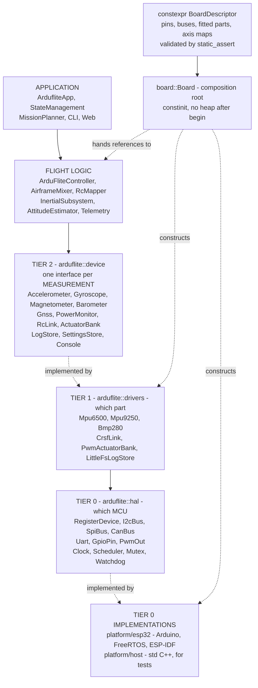
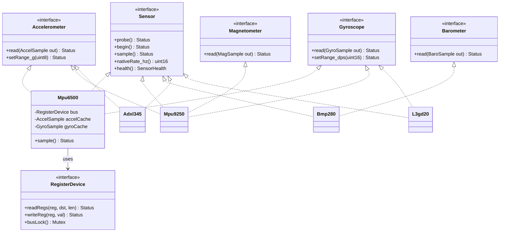
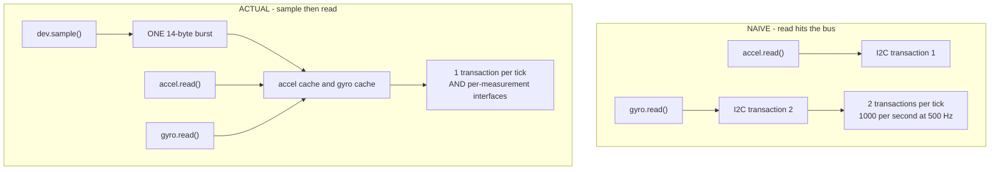
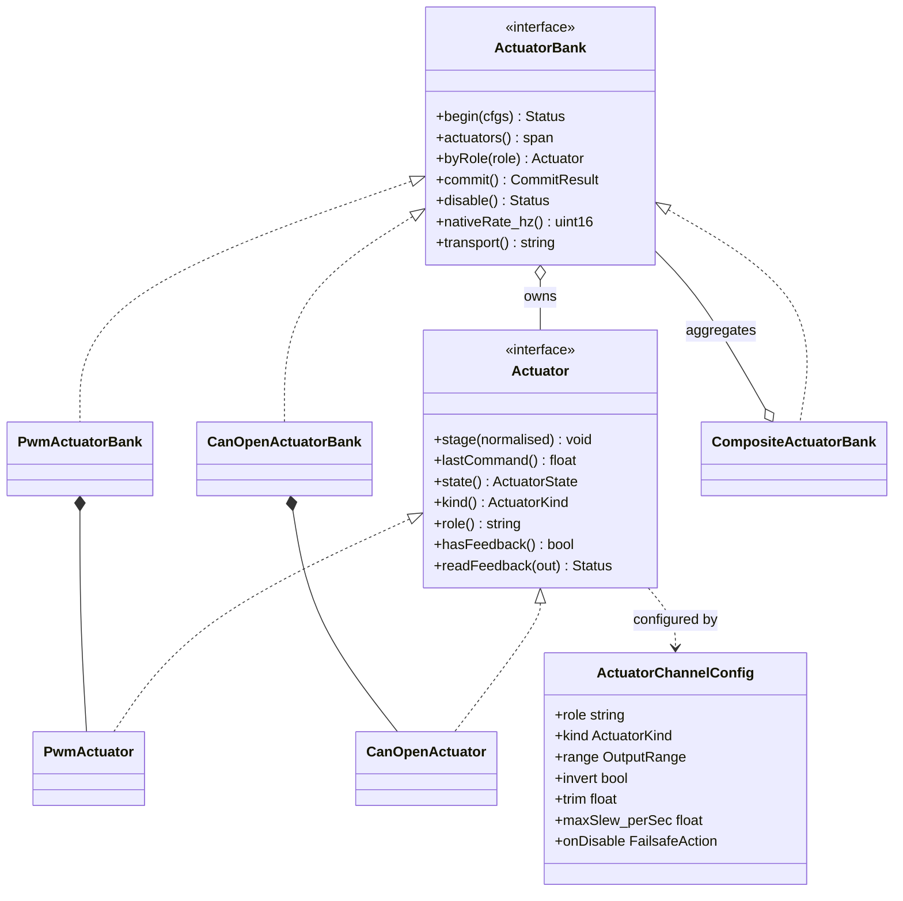
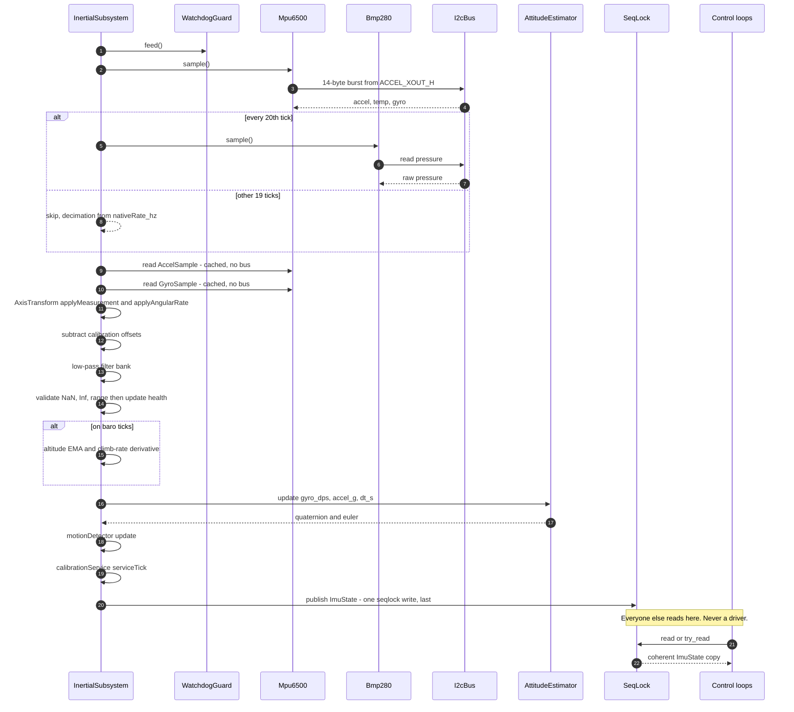
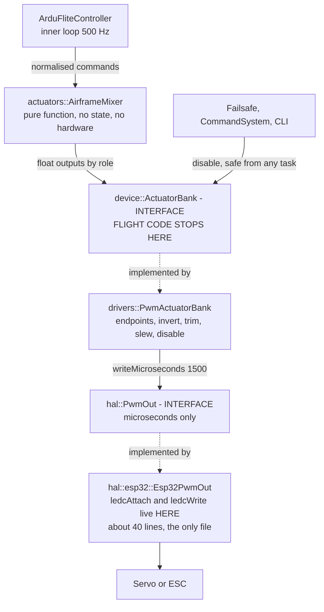
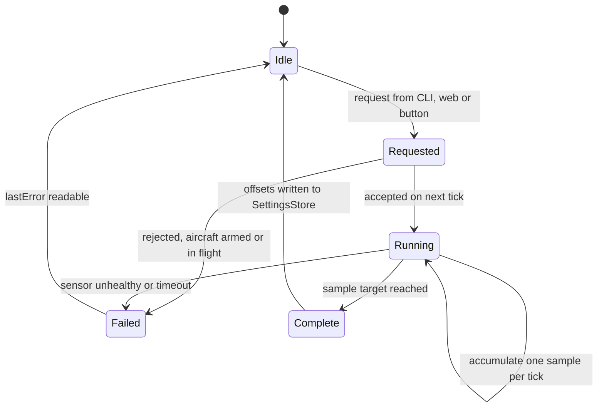
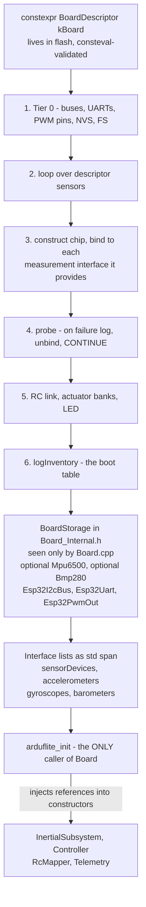
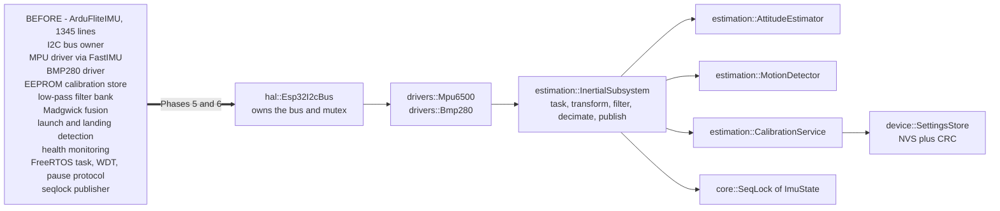
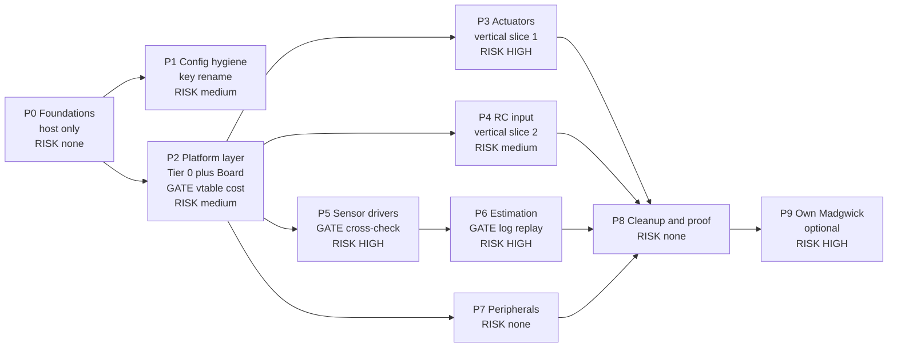

# 10 — Architecture Diagrams

**Status:** Draft, revision 2 (conservative Mermaid) · **Date:** 2026-08-02

Visual companion to §02 (architecture), §03 (interfaces) and §06 (migration plan).

> **Revision 2:** rewritten in a deliberately conservative Mermaid subset after the
> first version failed to render. See [Troubleshooting](#troubleshooting) at the end
> for what was actually wrong and how to verify these.

| # | Diagram | Answers |
|---|---|---|
| 1 | [Tier dependency](#1-tier-dependency) | What depends on what, and in which direction |
| 2 | [Sensor class model](#2-sensor-class-model) | How one chip provides several measurements (ADR-019) |
| 3 | [Why sample and read are separate](#3-why-sample-and-read-are-separate) | The cost that makes ADR-019 affordable |
| 4 | [Actuator class model](#4-actuator-class-model) | Actuator vs ActuatorBank; how PWM and CANopen mix (ADR-020, ADR-025) |
| 5 | [Inertial tick sequence](#5-inertial-tick-sequence) | One 500 Hz cycle, and where the bus is touched |
| 6 | [Control output path](#6-control-output-path) | Where ledc lives, and where it does not |
| 7 | [Calibration state machine](#7-calibration-state-machine) | Calibration without a task-pause protocol |
| 8 | [Board composition](#8-board-composition) | Who constructs what, once, at boot |
| 9 | [The decomposition](#9-what-happens-to-ardufliteimu) | What ArduFliteIMU becomes |
| 10 | [Phase dependencies](#10-phase-dependencies) | What can run in parallel, and what gates what |

---

## 1. Tier dependency

The single most important property: **arrows only point downward.** A tier may use
the tier below it and never the one above.



**The two rules that make this work:**

1. Flight code names only `arduflite::device` types. It never sees a bus, a pin or a
   driver.
2. Only `Board.cpp` names a concrete driver. Everywhere else holds interface
   references.

Both are checked mechanically by the include-direction job in §05 §4 — not left to
discipline.

---

## 2. Sensor class model

The part that differs most from the first draft. **A chip is not an interface.** A
6-DOF IMU implements `Accelerometer` *and* `Gyroscope`; discrete parts implement one
each; flight code cannot tell the difference.



Reading the diagram:

* **`sample()` is the only method that touches the bus.** Every `read()` is `const`
  and returns the cache filled by the last `sample()`.
* **`Mpu6500` realises three interfaces.** One 14-byte burst read from
  `ACCEL_XOUT_H` refreshes both caches.
* **`Adxl345` and `L3gd20` are shown deliberately.** Custom hardware with discrete
  parts produces exactly the same view of the world as one combined chip.
* **Redundancy is the same idea again** — two `Mpu6500` entries at 0x68 and 0x69
  mean `accelerometers()` returns two pointers.

---

## 3. Why sample and read are separate



This is what makes ADR-019 affordable. Without the split, per-measurement interfaces
would double I2C traffic on a 400 kHz bus at 500 Hz.

---

## 4. Actuator class model

`ActuatorBank` names no transport. Everything PWM-specific lives in the driver's
constructor, fed by the board descriptor.



Reading the diagram:

* **Two levels.** `Actuator` is one output — what flight code holds, by name.
  `ActuatorBank` is one *transport's* outputs — where `commit()` and `disable()`
  live, because those are batched **bus** operations (ADR-025).
* **`ActuatorChannelConfig` is transport-neutral** — no microseconds, no node IDs.
  That was the bug in the first draft (ADR-020).
* **`write()` stages, `commit()` pushes.** For CAN that is one PDO group plus SYNC,
  atomically. `commit()` returns `Status`; `write()` cannot fail.
* **`disable()` is the only method safe from any task** — the failsafe path needs it,
  and it disables every bank unconditionally.
* **`commit()` returns `CommitResult`**, whose `staleMask` names the channels that
  failed to update. "Something failed" is not actionable in flight; "the elevator is
  stale" is.
* **`ActuatorKind`** (Proportional / Binary / Latching) is *orthogonal* to transport
  — a binary retract can hang off PWM or CAN. It lives in the channel config, not in
  a separate interface (ADR-024).
* **`CompositeActuatorBank`** flattens several banks into one index space, so four
  PWM surfaces plus one CAN throttle plus a retract needs no special case — but
  `commit()` is atomic only *within* a bank. Keep primary flight surfaces on one.

---

## 5. Inertial tick sequence

The 12-step ordering contract from §03 3.8, as it runs once per 2 ms.



Two contracts are visible here:

* **Bus access is confined to the early steps.** `read()` never touches it
  (review R1).
* **The seqlock publish is last and single.** Every other task reads `ImuState`,
  never a driver — which is what makes the unsynchronised driver cache safe.

---

## 6. Control output path

Answering "where does `ledc*()` live?" precisely.



`ledcAttach` / `ledcWrite` appear in **one file, roughly 40 lines**. Application code
calls `outputs.write(kElevator, -0.3f)` and never sees `PwmOut`, let alone `ledc`.
The static-check job greps flight code for `ledc`, `Wire`, `Serial` and `Servo` and
fails the build on a hit — so the property cannot decay.

---

## 7. Calibration state machine

Replaces the current `pauseTask()` / `_taskPaused` cooperative spin-wait, which
exists only because the IMU task owns the bus that calibration needs.



* `request()` is thread-safe — it sets an atomic flag. **Step 11 of the tick does the
  work**, inside the task that already owns the bus.
* No pause, no spin-wait, no deadlock to avoid.
* A 10-second gyro calibration is 5000 ticks of accumulation, not a blocking loop, so
  control loops keep running on the last good `ImuState` and the watchdog keeps being
  fed by the normal path.

---

## 8. Board composition

Everything is constructed once, at boot, in static storage.



Three properties worth noting:

* **`Board.h` never names a driver type.** `BoardStorage` lives in
  `Board_Internal.h`, included only by `Board.cpp` (review R3), so the layering check
  is real rather than theatre.
* **Each sensor fails independently.** A dead barometer removes one entry from one
  list; the gyro keeps flying the aircraft.
* **Nothing else calls `Board`.** `arduflite_init()` pulls references out and injects
  them. That is the difference from AP_HAL's global `hal` object.

---

## 9. What happens to ArduFliteIMU

The payoff. 1345 lines doing nine jobs becomes seven independently testable
components.



Every box on the right is independently host-testable. On the left, none of it is —
which is why `test_motion_signals.cpp` and `test_baro_decimation.cpp` currently
contain hand-maintained *copies* of the logic rather than tests of it.

---

## 10. Phase dependencies



**P3, P4, P5 and P7 are mutually independent** once P2 lands, so they can be
reordered around flying weather and bench availability. The one hard constraint is
**P5 then P6**: new drivers and the new estimation layer are deliberately kept in
separate branches with separate oracles, so a bad flight afterwards is attributable
to one or the other.

Actuators and RC come *before* the IMU on purpose: they are complete vertical slices
through all four tiers, bench-testable in minutes. If the tier model is wrong, that
becomes obvious there rather than inside the IMU rewrite.

---

## Troubleshooting

### What was actually wrong in revision 1

There is no Mermaid runtime on this machine, so revision 1 was written without ever
being parsed. An audit against the syntax rules found genuine bugs, not just
rendering trouble:

| Problem | Where | Why it breaks |
|---|---|---|
| `stroke-dasharray: 5 5` | diagram 5 | **Invalid.** Space after the colon and inside the value; the style parser expects `key:value` with no spaces |
| `[` and `]` inside edge labels | diagram 5 | `-->\|"roll, pitch, yaw ∈ [-1,1]"\|` — brackets in edge labels break the parser even when quoted |
| `direction LR` inside `classDiagram` | diagrams 2, 4 | Requires Mermaid **v10+**; older renderers error out |
| `note for X "..."` in `classDiagram` | 5 places | Requires Mermaid v10+ |
| `rect rgba(...)` in `sequenceDiagram` | diagram 5 | Widely supported, not universal |
| 26 `style` directives using 8-digit hex (`#1f6feb22`) | throughout | `#RRGGBBAA` is not accepted by every renderer |
| Unicode `≪ ≫ ∈ ⟵ ·` in labels | throughout | Renderer- and font-dependent |

Revision 2 removes **all** of them. What remains is the subset that has been stable
for years: `flowchart`, `classDiagram` with `<<interface>>` and `<|..`,
`sequenceDiagram` with `alt`/`else`, and `stateDiagram-v2`. Colour coding is gone —
risk levels are written into the node text instead. Once these render, styling can be
added back deliberately, one diagram at a time.

### If they still show as empty blocks

Then it is the viewer, not the syntax — and the two causes look different:

* **Empty block** — the viewer recognises ```` ```mermaid ```` and swallows the
  content, but has no Mermaid engine to render it.
* **Raw source shown as a code block** — the viewer has no Mermaid support at all.
* **Red error box** — Mermaid ran and the syntax is wrong.

To settle it in about thirty seconds, paste one diagram's body into
<https://mermaid.live>. It is the reference implementation and reports parse errors
with a line number.

Known-good viewers:

* **GitHub** — renders natively in Markdown; syntax errors appear as a red box.
* **VS Code** — the built-in preview does **not** support Mermaid. Install
  *Markdown Preview Mermaid Support* (`bierner.markdown-mermaid`).
* **Obsidian, GitLab, Typora** — native support.

If a specific diagram fails at mermaid.live, send me the error — it names the
offending line and I will fix that diagram.

### Keeping these honest

* They document the **target** design, not what exists today. §00 describes the
  current state.
* Where a diagram and the prose disagree, §02–§04 win and the diagram is a bug.
* Phase 0 will force changes to §03 as the interfaces meet a compiler for the first
  time. Diagrams 2, 4 and 5 encode interface shape — update them when that happens.
